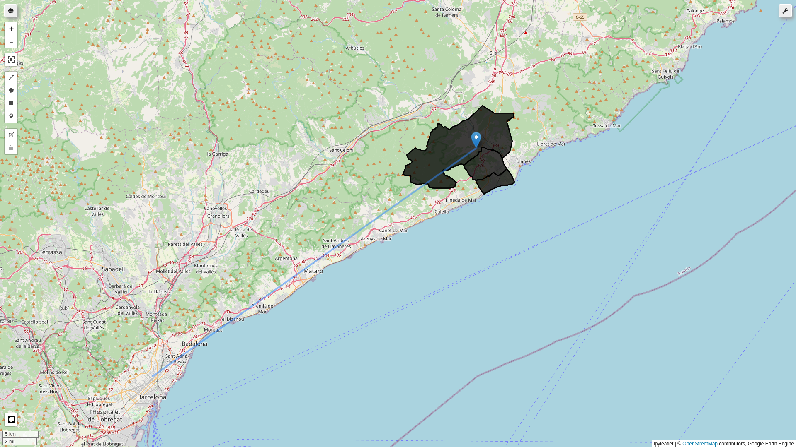
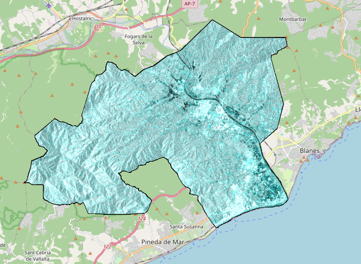

# Google Earth Engine Flood Impact Showcase
Authored by Joseph Doundoulakis in 2022 as a showcase of Earth Observation capabilities in assessing flood impact.

*Note: To use this notebook you have to sign-in to your GEE account.*

## Case study
Assesing the impact of storm Gloria in the municipalities of Tordera, Parafolls and Malgrat de Mar, in northern Catalunya, Spain, during January of 2020.

### Area of interest north of Barcelona.


### Flooded area as seen in a **Sentinel-1** SAR image.



## Installing and running on a Unix environment
Please use the provided ```run.sh``` bash script for running the code sample, as it handles the installation of an isolated virtual environment with all the dependencies of the code sample.

i.e.
```bash
$ ./run.sh
```

The installation occurs only during the first run.

## Select the correct ipython kernel
Switch to the ```eo_code_sample``` kernel in jupyter before running the notebook, if not selected by default.


## Uninstalling
Simply delete the directory.
