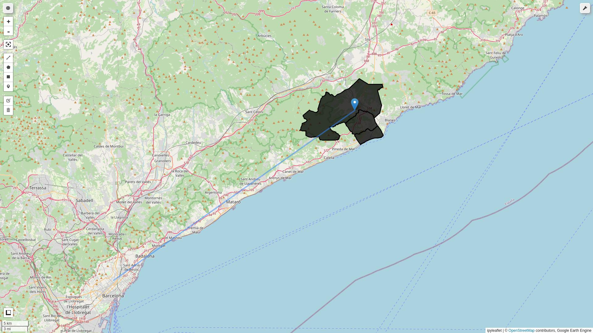
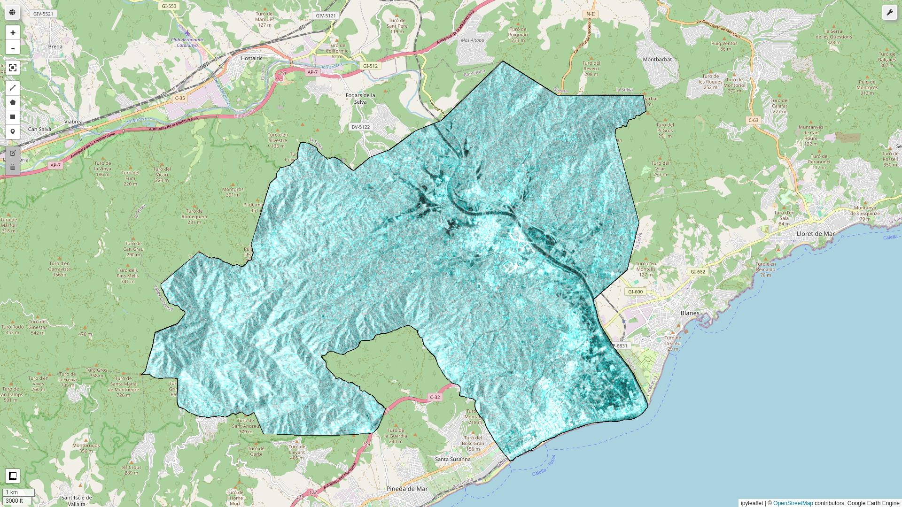
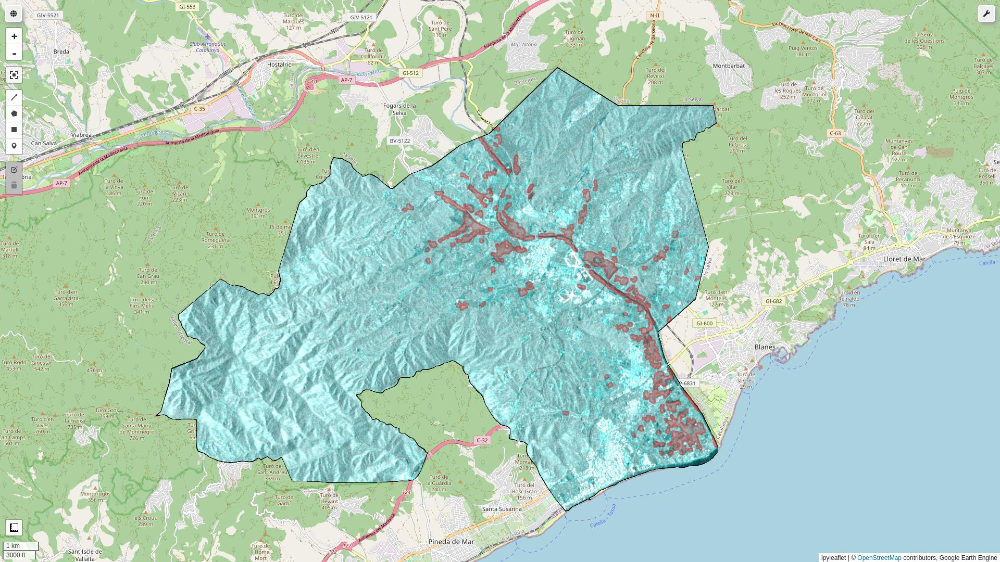

# Google Earth Engine Flood Impact Showcase
Authored by Joseph Doundoulakis in 2022 as a showcase of Earth Observation capabilities in assessing flood impact.

*Note: To use this notebook you have to sign-in to your GEE account.*

## Case study
Assesing the impact of storm Gloria in the municipalities of Tordera, Parafolls and Malgrat de Mar, in northern Catalunya, Spain, during January of 2020.

### Area of interest north of Barcelona.


### Flooded area as seen in a **Sentinel-1** SAR image.




## Installing and running in a Unix environment
Please use the provided ```run.sh``` bash script to run the notebook, as it handles the installation of dependencies in an isolated virtual environment.

**Example:**
```bash
$ ./run.sh
```
The installation occurs only during the first run.

## Select the correct ipython kernel
Switch to the ```gee-flood-impact``` kernel in the notebook UI before running, if not selected by default.

## Uninstalling
Simply delete the directory. The notebook kernel is uninstalled automatically.
